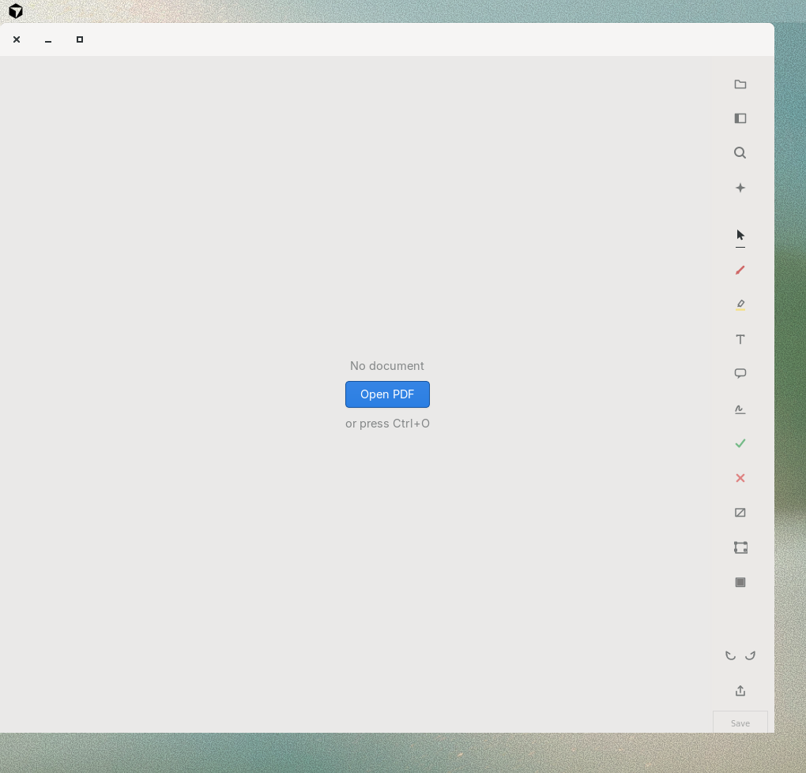
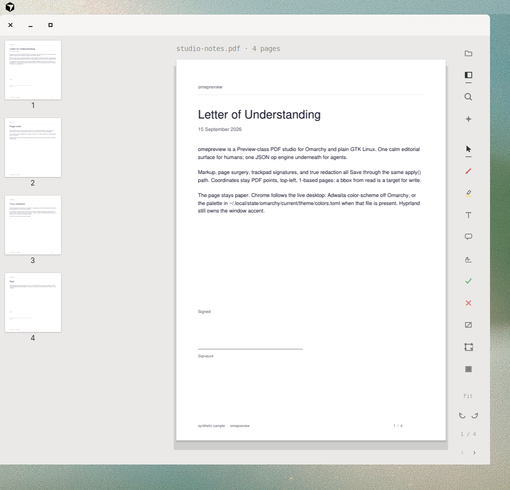

# omapreview

**A Preview-class PDF studio for Omarchy and plain GTK Linux.** · **0.1.0**

Command and launcher name: **omapreview**. Super+Space opens an empty editor;
Open (Ctrl+O) picks a PDF. Humans mark up on paper-on-desk chrome. Agents
speak the same JSON ops.

<p align="center">
  
</p>

<p align="center">
  
</p>

<p align="center">
  
  &nbsp;
  
</p>

<p align="center">
  
  &nbsp;
  
</p>

## The problem

Linux still does not have a Preview.app. Viewers show a page. Office suites
import a PDF as a drawing. Acrobat is not the daily driver on Omarchy.
“Redact” is too often a black rectangle that still contains the text.
Signatures are screenshots. Page surgery means a second tool.

Agents that edit PDFs usually fork a one-off script. The human then cannot
open the same file in an editor that shares that write path — so the last
mile is copy-paste, or a surprise overwrite.

You need one studio that opens empty from Super+Space, lets you pick a PDF
in-app, marks up, signs, knifes pages, redacts for real, and lets an agent
propose the same ops as ghosts you can nudge and Save.

## Why omapreview

- **Preview-class launch.** The desktop `Exec` is `omapreview edit %f` — no
  file-picker in the launcher. No file → empty window. A PDF from the file
  manager still opens via `%f`.
- **One engine.** GTK editor, CLI, and optional MCP server all call
  `engine.apply()`. New capability = new op. No GUI-only writes.
- **True redact.** Content is removed, not painted over. Default save is a
  `*_redacted.pdf` copy.
- **Page knife.** Insert, delete, rotate, extract, reorder in the sidebar or
  as ops. Two windows can copy pages.
- **Trackpad signatures.** Space arms, finger-on-pad inks, Enter saves SVG
  to `~/Downloads/omapreview/signature/`. Place from the Sign tool.
- **Omarchy-native.** Super+Space, `uwsm`-safe absolute `Exec`, live
  `colors.toml` chrome. Fine on plain GTK too.

The user-facing command is **omapreview**. The Python package is still
`omepreview`. Forked from [omapdf](https://github.com/pbergin11/omapdf);
omapreview is its own product.

## Install

Arch / Omarchy, no clone (AUR registration is closed):

```bash
curl -fsSL https://github.com/Skeptomenos/omapreview/releases/download/v0.1.0/install.sh | bash
```

That installs pacman deps (`gtk4`, `python`, `python-gobject`, `python-cairo`,
`python-pymupdf`), fetches the **v0.1.0** source snapshot, puts `omapreview`
on `~/.local/bin`, and writes
`~/.local/share/applications/omapreview.desktop`. Super+Space, type
`omapreview`. If the menu is stale: `omarchy-refresh-applications` or
`omarchy restart shell`.

**From a git checkout** (on omarchy-air the tree is still `~/omepreview`):

```bash
git clone https://github.com/Skeptomenos/omapreview.git
cd omapreview
bash packaging/install-user.sh
omapreview --version                  # omapreview 0.1.0
```

The venv must be `python -m venv --system-site-packages .venv` so GTK
`gi` stays visible. Desktop file: `share/omapreview.desktop`. Application
ID: `org.omepreview.Editor`. Window-control override:
`OMEPREVIEW_WINDOW_CONTROLS=1|0`.

## Use

### Editor

1. Super+Space → **omapreview** (or `omapreview edit`) — empty desk.
2. **Open PDF** or **Ctrl+O**, or `omapreview edit document.pdf`.
3. Markup on the rail (select, pen, highlight, text, note, sign, stamps,
   shapes, crop, redact). Thumbnails: F9. Search: Ctrl+F.
4. Edits are ghosts until **Save** (Ctrl+S). Ctrl+Z undoes across saves.

| Key | Action |
|-----|--------|
| **Ctrl+O** | Open a PDF |
| **Ctrl+S** | Save pending ghosts through the engine |
| **Ctrl+Z** / **Ctrl+Shift+Z** | Undo / redo (including saves) |
| **Space** (signature pad) | Arm trackpad recording |
| **Enter** (signature pad) | Save SVG |
| **R** | Redact tool |
| **F9** | Thumbnail sidebar |

Sign: pick a saved SVG and drag it onto the page. Record new from that
menu. Details: [`docs/signature-trackpad.md`](docs/signature-trackpad.md).

### Command line

```bash
omapreview edit                    # empty window; Open (Ctrl+O)
omapreview edit document.pdf
omapreview read document.pdf --json
omapreview sig draw                # Space to record; Enter saves SVG
omapreview sign document.pdf --page 2 --at 120,540 -o signed.pdf
omapreview pages document.pdf --list
omapreview --version               # omapreview 0.1.0
```

### Agents

Every edit is a JSON op list. Same engine as Save in the GUI. Spec:
[`docs/ops.md`](docs/ops.md). Playbook: [`skill/SKILL.md`](skill/SKILL.md).

```bash
omapreview apply document.pdf --ops edits.json -o out.pdf
omapreview-mcp
```

Consequential ops (sign, flatten, redact) default to dry-run / propose.
The human confirms. `--ops proposal.json` on `edit` loads draggable ghosts.

## License

[AGPL-3.0-or-later](LICENSE)
