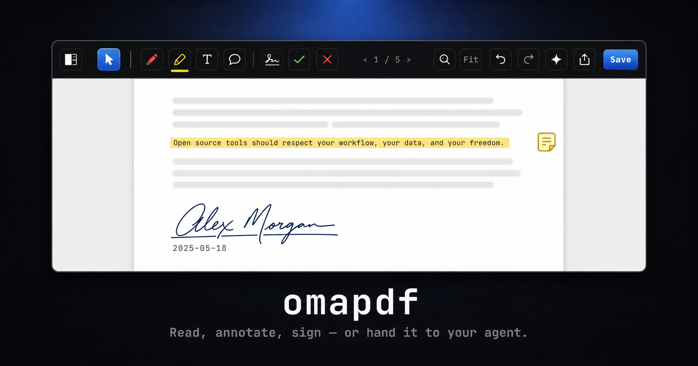

# omapdf

**Preview.app for Linux — but your agent can drive it.**



omapdf is an agent-native PDF tool: a fast GTK4 **editor** for reading,
annotating, and signing; a scriptable **CLI**; an **MCP server** for AI
agents; and an **Omarchy** integration that ties them all to the operating
system. One op engine underneath — anything a human can do by hand, an agent
can do by instruction, and vice versa.

```bash
omapdf edit lease.pdf                       # the editor
omapdf sign lease.pdf --page 4 --at 120,540 --date -o signed.pdf
# …or just tell your agent: "fill out this lease, highlight anything
#  unusual, and get it ready for my signature"
```

## Why

The "someone emailed me a PDF, I need to highlight two things, sign it, and
send it back" workflow is macOS Preview's killer feature — and Linux has no
lightweight equivalent. And nobody anywhere treats AI agents as first-class
PDF users. omapdf does both, with one architecture:

## One operations API, every client is thin

Every action — highlight, comment, fill a field, stamp a signature, draw ink
— is a small JSON operation. A document edit is a list of them. The editor,
the CLI, and the MCP server all funnel through the same engine:

```
     human                            agent
       │                                │
 ┌─────┴─────┐                 ┌────────┴────────┐
 │  editor   │                 │  MCP server /   │
 │  (GTK4)   │                 │  Claude skill   │
 └─────┬─────┘                 └────────┬────────┘
       │          ops (JSON)            │
       └──────────────┬─────────────────┘
              ┌───────┴───────┐
              │   op engine   │  validate → resolve → apply → report
              │   (PyMuPDF)   │
              └───────┬───────┘
                 document.pdf
```

Every applied op echoes back its resolved geometry, so either side can show
the other exactly what changed and where. Everything written is a
**standard PDF annotation** — Acrobat, Preview, and Evince users see your
notes and highlights as normal comments.

## The editor (`omapdf edit`)

A native GTK4 editor, Preview-fast, designed for Omarchy but plain-GTK
portable:

- **Tools** (hand-drawn vector icon set): select/drag, pen with a
  tap-again color palette, highlighter, text, sticky notes, signature
  placement, green-check and red-cross stamps
- **Ghost model**: everything you place is a draggable, nudgeable pending
  item until Save bakes it through the op engine — and **undo crosses the
  save boundary**: Ctrl+Z after saving reverts the file and resurrects the
  saved items as editable ghosts
- **Reading comforts**: thumbnail sidebar (F9), fit-width zoom that tracks
  the live viewport, zoom presets + Ctrl+scroll, full-document search
  (Ctrl+F) with match cycling, page navigation by Up/Down, PgUp/PgDn,
  Home/End, Ctrl+G go-to-page
- **Comments open on click**: click any saved annotation to read its text —
  including comments left by agents or by other people's PDF apps
- **Agent proposals as ghosts**: `omapdf edit doc.pdf --ops proposal.json`
  loads an agent's dry-run ops as selected, draggable overlays — nudge,
  then Save. Agent proposes, human confirms.
- **Ask your agent** (✦): type a question, it opens your OS default agent
  (`omarchy agent prompt`) with the document attached. The editor
  **watches the file** and reloads itself when the agent saves changes.
- **Share** (native, no fake share sheet): email attach, LocalSend, copy the
  file (or a zip of it) straight onto the clipboard, show in folder — with
  an optional flatten-copy-first toggle
- Save celebration included. You'll see.

## The CLI

```bash
omapdf read doc.pdf                  # structured JSON: text+bboxes, fields, annots
omapdf read doc.pdf --text-only      # just the words
omapdf fields form.pdf               # fillable fields with names and rects
omapdf snapshot doc.pdf --page 2 --grid 50   # page PNG with a labeled
                                     # coordinate grid — agents read placement
                                     # coordinates straight off the image

omapdf annotate doc.pdf --page 2 --match "termination clause"
omapdf note doc.pdf --page 2 --at 400,300 --text "negotiate this"
omapdf fill form.pdf --field tenant_name "Peter Bergin" --field rent "1800"
omapdf apply doc.pdf --ops edits.json        # atomic batch of ops

omapdf sig draw                      # draw your signature once (GTK window)
omapdf sig add ~/sig.png --name work # …or import an image
omapdf sign doc.pdf --page 4 --at 120,540 --date -o signed.pdf
omapdf flatten doc.pdf -o final.pdf  # bake everything in for any viewer
omapdf open doc.pdf                  # opens the omapdf editor
```

Every edit command takes `-o` (default: in place), `--dry-run`, and
`--json` (each op returns its resolved geometry). Coordinates are PDF
points, origin top-left, 1-based pages — identical to what `read` reports.
The ops vocabulary is specified in [docs/ops.md](docs/ops.md).

## Agents

```bash
claude mcp add omapdf -- omapdf-mcp
```

MCP tools: `read_pdf`, `list_form_fields`, `apply_ops`, `highlight`,
`add_note`, `fill_field`, `place_signature` (dry-run by default —
confirm-before-ink), `list_signatures`, `flatten_pdf`.

The Claude Code **skill** in [`skill/`](skill/) is a full PDF-assistant
playbook: recipes for review-and-highlight, form filling, signing,
redlining, checklists, extraction with page citations — built around a
**precision ladder**: text anchors → grid snapshot (look at the page) →
dry-run → verify the written result visually → hand a draggable ghost to
the human when taste matters.

## Install

```bash
git clone https://github.com/pbergin11/omapdf && cd omapdf
python -m venv --system-site-packages .venv    # system gi for the GTK editor
.venv/bin/pip install -e '.[mcp]'
ln -s "$PWD/.venv/bin/omapdf" ~/.local/bin/omapdf
ln -s "$PWD/.venv/bin/omapdf-mcp" ~/.local/bin/omapdf-mcp
ln -s "$PWD/bin/omapdf-pick" ~/.local/bin/omapdf-pick
```

Requires Python ≥ 3.11, PyMuPDF, and (for the editor and `sig draw`)
PyGObject + GTK4 from your distro. Arch packaging in
[`packaging/PKGBUILD`](packaging/PKGBUILD).

Make omapdf your system PDF handler:

```bash
cp share/omapdf.desktop ~/.local/share/applications/
xdg-mime default omapdf.desktop application/pdf
```

## Omarchy integration

- **Top-bar widget** ([`shell-plugin/`](shell-plugin/)): a PDF pill —
  click for a recent-PDFs menu, pick one, it opens in the editor
  (`ln -s .../shell-plugin/omapdf.bar ~/.config/omarchy/plugins/omapdf.bar`,
  then `omarchy bar put omapdf.bar --section right`)
- **Ask-agent** uses `omarchy agent prompt`, so it launches whatever
  default agent the user picked (`omarchy default agent`), in Omarchy's
  native agent window; Voxtype dictation works in the ask box like any
  text field
- Packaged in the spirit of [omasnap](https://github.com/tobi/omasnap): a
  focused, single-purpose native tool

## Status & roadmap

Working today: op engine, CLI, MCP server + skill, signature store and
drawing window, the full editor, bar widget, agent ask/watch loop, tests.
See [docs/roadmap.md](docs/roadmap.md) for what's next — headlines:
signature-line auto-detection (`sign --auto`), annotation deletion/editing
of saved items, comments summary page, cryptographic (PAdES) signing via
pyHanko.

## License

AGPL-3.0-or-later (matching our PyMuPDF dependency). See [LICENSE](LICENSE).
