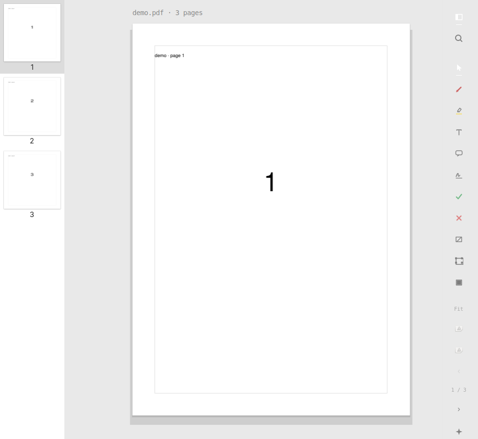
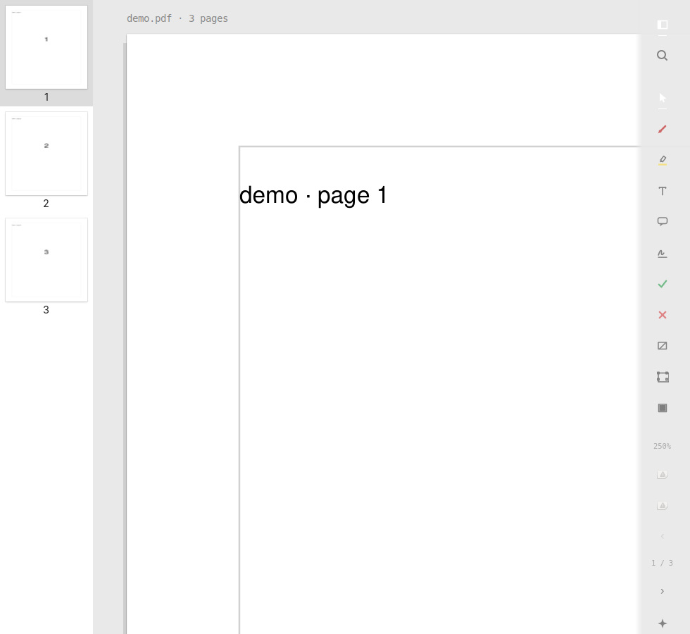

# omepreview

**Preview.app for Linux** — a fast GTK4 PDF viewer with an editorial studio look, a scriptable CLI, and an agent-ready op engine underneath.

Open a document, read and annotate with calm paper-on-desk chrome, sign with a trackpad-style recorder, and hand the same operations to your agent when you want automation.

<p align="center">
  
</p>

<p align="center">
  <em>Light · Fit page</em> &nbsp;·&nbsp;
  <a href="docs/screenshots/fit-dark.png">Dark Fit</a> &nbsp;·&nbsp;
  <a href="docs/screenshots/zoom-light.png">Zoom</a>
</p>

<p align="center">
  
  &nbsp;
  
</p>

## Why

The “open a PDF, highlight two clauses, sign it, send it back” workflow is Preview’s killer feature — and Linux deserves something as fast and pleasant, without giving up automation. omepreview is both: a human editor you actually want to stare at, and a stable JSON op contract agents can drive.

## Install

```bash
python -m venv --system-site-packages .venv   # keeps system GTK bindings
.venv/bin/pip install -e '.[dev]'
```

Arch users: see [`packaging/PKGBUILD`](packaging/PKGBUILD).

**Version:** `0.0.1` (first release)

## Quick start

```bash
omepreview edit document.pdf          # GTK editor (default handler for PDFs)
omepreview read document.pdf --json   # text, bboxes, fields — agent-friendly
omepreview sig draw                   # Preview-style trackpad signature
omepreview sign document.pdf --page 2 --at 120,540 -o signed.pdf
```

Set `OMEPREVIEW_VIEWER=1` to force an external viewer instead of the built-in editor.

## Editorial look

- One desk tone from the active GTK theme (light or dark)
- Paper sheet with folio line and soft shadow stack
- Right overlay rail: transparent glyphs at 62% ink, ghost Save — not filled GTK pills
- Omarchy mode by default (`OMAPDF_WINDOW_CONTROLS=0`); thin titlebar on other distros

See [`docs/signature-trackpad.md`](docs/signature-trackpad.md) for trackpad signing behaviour on Linux.

## For agents

Every edit is a list of JSON ops (`highlight`, `place_signature`, `crop_pages`, …). The CLI, MCP server (`omepreview-mcp`), and editor all call the same engine.

```bash
omepreview apply --ops edits.json -o out.pdf
omepreview-mcp   # optional MCP extra
```

Spec: [`docs/ops.md`](docs/ops.md)

## License

AGPL-3.0-or-later. Forked from [omapdf](https://github.com/pbergin11/omapdf); omepreview is its own product.
