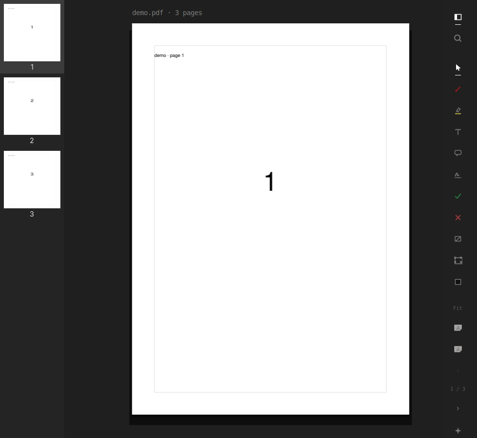
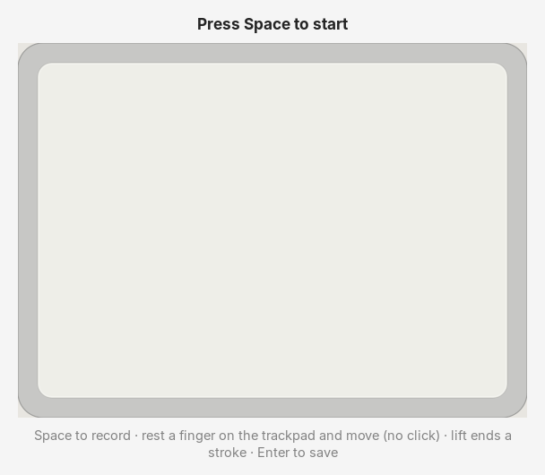
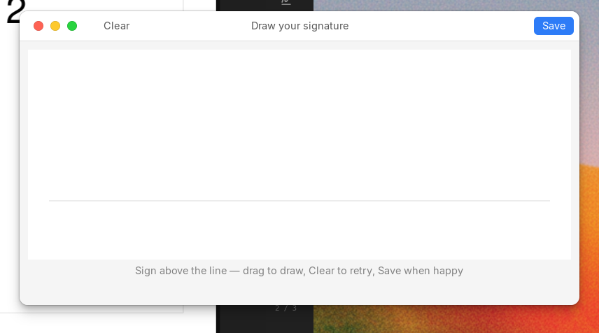

# omepreview

**A Preview-class PDF studio for Omarchy and plain GTK Linux.** · **0.0.1**

omepreview is a fast GTK4 editor for reading, marking up, and signing PDFs —
with Preview-style page surgery, true redaction, and trackpad signatures. One
calm editorial surface for humans; one JSON op engine underneath for agents.

<p align="center">
  
</p>

<p align="center">
  
  &nbsp;
  
</p>

<p align="center">
  
  &nbsp;
  
</p>

---

## Signatures (Preview-style)

Same muscle memory as macOS Preview:

| Key | Action |
|-----|--------|
| **Space** | Arm recording (finger **on** the trackpad + move inks; no click) |
| **Enter** | Save SVG to `~/Downloads/omapreview/signature/` |
| Space again | Clear and re-arm |

In the editor, the **Sign** tool opens a dropdown of saved SVGs. Pick one and
**drag it onto the page** (or click to place). Record new / re-record from
that menu. Details: [`docs/signature-trackpad.md`](docs/signature-trackpad.md).

## What you get

| Surface | Role |
|--------|------|
| **GTK editor** | Paper-on-desk chrome, overlay tool rail, thumbnails, pinch zoom |
| **CLI** | `read`, `edit`, `sign`, `pages`, `apply` — scriptable and agent-friendly |
| **MCP** | `omepreview-mcp` optional extra; same ops as the CLI |
| **Signatures** | Preview-style trackpad recorder (`omepreview sig draw`) + placement |

**Page knife** — insert, delete, rotate, extract, reorder via sidebar or ops.  
Two-window page copy uses `application/x-omepreview-pages` (legacy
`application/x-omapdf-pages` still pastes).  
**True redact** — content removal, not just black rectangles.  
**Editorial rail** — transparent glyphs at 62% ink; ghost Save until you have pending work.

Forked from [omapdf](https://github.com/pbergin11/omapdf). omepreview is its own product.

## Install

No GitHub release tag yet. Clone `main` and use a venv (keeps system GTK
bindings for the editor):

```bash
git clone https://github.com/Skeptomenos/omepreview.git
cd omepreview
python -m venv --system-site-packages .venv
.venv/bin/pip install -e '.[dev]'
.venv/bin/omepreview --version          # omepreview 0.0.1
```

**Arch:** [`packaging/PKGBUILD`](packaging/PKGBUILD) builds **git `main`**, not
a `v0.0.1` tarball (that archive is not published). From a clone:

```bash
cd packaging && makepkg -si
```

Or skip packaging and use the venv above.

Desktop handler: `share/omepreview.desktop` · Application ID: `org.omepreview.Editor`

Window-control override: `OMEPREVIEW_WINDOW_CONTROLS=1|0`
(`OMAPDF_WINDOW_CONTROLS` still works as a deprecated alias).

## Quick start

```bash
omepreview edit document.pdf
omepreview read document.pdf --json
omepreview sig draw                   # Space to record; Enter saves SVG
omepreview sign document.pdf --page 2 --at 120,540 -o signed.pdf
omepreview --version                  # omepreview 0.0.1
```

## For agents

Every edit is a list of JSON ops. See [`docs/ops.md`](docs/ops.md).

```bash
omepreview apply --ops edits.json -o out.pdf
omepreview-mcp
```

## License

[AGPL-3.0-or-later](LICENSE)
